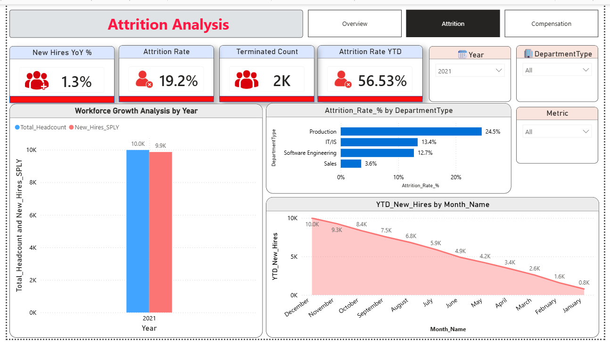

# HR Analytics Dashboard — Power BI

An interactive Power BI dashboard for tracking workforce health: headcount, attrition, diversity, performance, and compensation. Built as a single `.pbix` file with three report pages and a star-schema data model.

overview.png

---

## 📊 Overview

This dashboard helps HR and people-ops teams answer questions like:

- How many employees do we have, and how is the workforce trending?
- What's our attrition rate, and where are we losing people?
- How fair and competitive is our compensation across departments and career levels?
- Are we investing enough in training, and is it paying off?
- How diverse is our workforce (gender, career level, department)?

It's built for slicing by **Year**, **Department**, **Career Level Band**, and **Salary Band**, so leadership can drill from a company-wide view down to a specific team.

---

## 🗂️ Report Pages

### 1. Overview
The executive summary page — high-level KPIs and workforce composition at a glance.

| Visual | Type | Purpose |
|---|---|---|
| Total Employees | Card | Headcount snapshot |
| Active Employees | Card | Current active workforce |
| Attrition Rate | Card | % of employees who left |
| High Performers % | Card | Share of top performance ratings |
| Average Salary | Card | Company-wide average pay |
| Training Investment | Card | Total spend on training |
| Female % | Card | Gender diversity metric |
| Avg Tenure (Yrs) | Card | Average years of service |
| Employee Distribution by Career Level | Donut Chart | Headcount split by career band |
| Active Workforce by Department | Clustered Bar Chart | Headcount by department |

**Filters:** Year, Career Level Band, Department Type

### 2. Attrition
A deep dive into hiring and exits.

| Visual | Type | Purpose |
|---|---|---|
| New Hires YoY % | Card | Year-over-year hiring growth |
| Attrition Rate YTD | Card | Year-to-date attrition |
| Attrition Rate | Card | Overall attrition |
| Terminated Count | Card | Total exits |
| Workforce Growth Analysis by Year | Clustered Column Chart | Hires vs. exits over time |
| Trend over time | Line Chart | Attrition/hiring trend line |
| Breakdown by department | Clustered Bar Chart | Attrition by department |

**Filters:** Year, Department Type, Metric (dynamic measure selector)

### 3. Compensation
Pay equity and training investment analysis.

| Visual | Type | Purpose |
|---|---|---|
| Average Salary by Department | Clustered Bar Chart | Pay comparison across departments |
| Average Salary by Career Level | Donut Chart | Pay distribution by seniority |
| Department-wise Training Investment | Clustered Column Chart | Training spend by department |
| Detail table | Table | Row-level compensation data |

**Filters:** Career Level Band, Salary Band

---

## 🧮 Data Model

The model follows a **star schema**, with one fact-style master table, supporting fact tables, a date dimension, and a dedicated measures table.

```
EmployeeMaster (core dimension/fact)
   ├── EngagementSurvey
   ├── Performance
   ├── Recruitment
   ├── Training
   └── DimDate (date dimension)

_Measures   → centralized DAX measures table
Metric      → field-parameter / dynamic metric selector table
```

| Table | Role |
|---|---|
| `EmployeeMaster` | Core employee records — department, career level, salary, tenure, gender |
| `EngagementSurvey` | Employee engagement / satisfaction data |
| `Performance` | Performance ratings, high-performer flags |
| `Recruitment` | New hire and recruitment data |
| `Training` | Training records and cost |
| `DimDate` | Date dimension for time intelligence (Year, Month) |
| `_Measures` | Houses all DAX measures used across the report |
| `Metric` | Parameter table powering the dynamic "Metric" slicer on the Attrition page |

**Relationship diagram:**


### Key Measures
- `Total_Headcount`, `Active_Headcount`
- `Attrition_Rate_%`, `Attrition_Rate_YTD`, `Terminated_Count`
- `New_Hires_YoY_%`, `New_Hires_SPLY`, `YTD_New_Hires`
- `High_Performer_%`
- `Avg_Salary`, `Salary_Rank_Dept`
- `Avg_Tenure`
- `Gender_Diversity_Ratio`
- `Total_Training_Cost`

### Key Columns
- `DepartmentType`, `Career_Level_Band`, `Salary_Band`
- `Salary`, `Year`, `Month_Name`, `Metric`

---

## 🛠️ Tech Stack

- **Tool:** Microsoft Power BI Desktop
- **Data modeling:** Star schema with DAX measures
- **Visuals:** Cards, donut charts, clustered bar/column charts, line chart, table, slicers, dynamic page navigation

---

## 🚀 How to Use

1. Download `pr4.pbix` from this repo.
2. Open it in [Power BI Desktop](https://powerbi.microsoft.com/desktop/) (free).
3. Use the slicers (Year, Department, Career Level, Salary Band) to filter the view.
4. Navigate between **Overview → Attrition → Compensation** using the in-report page navigator.

> **Note:** This file connects to a fixed/embedded dataset, so visuals will render as-is. To use it with your own data, update the underlying tables in Power BI's data model.

---

## 📁 Repo Structure

```
├── pr4.pbix          # Power BI report file
├── README.md         # This file
└── screenshots/      # Dashboard images (add yours here)
```

---

## 📸 Screenshots

### Overview Page


### Attrition Page


### Compensation Page


---

## 📌 Future Improvements

- [ ] Add drill-through pages for individual employee/department detail
- [ ] Add YoY comparisons for compensation and training spend
- [ ] Connect to a live data source (SQL/Excel/SharePoint) instead of static data
- [ ] Add tooltips with additional context per KPI

---

## 📄 License

Add a license of your choice (e.g., MIT) if you want others to reuse this report template.
